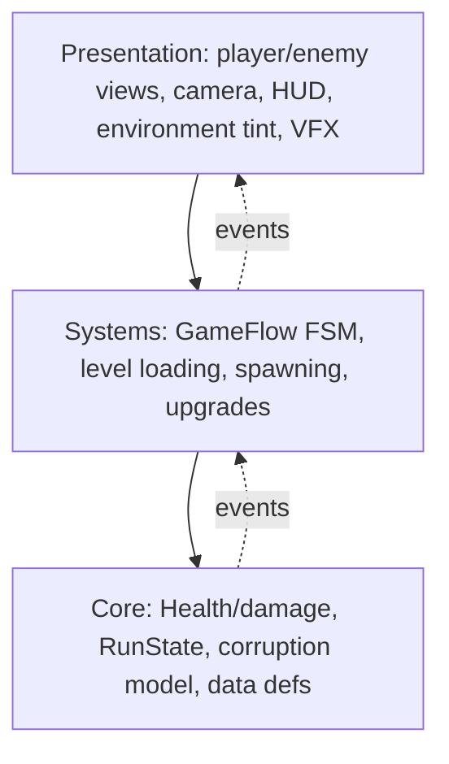

# IloveNature — Architecture & Development Plan

> Scope tier: **Prototype / Jam (48h)**. Rigor scaled per Guide §9: bootstrap, game-flow FSM, pooling, data-driven content for the sliced features — everything else plain code. This document is authoritative once approved; deviations are proposed out loud (Guide §13.7).

---

## 1. Concept Digest

| Aspect | Engineering restatement |
|---|---|
| Genre / camera | 2D side-scrolling platformer, orthographic follow camera |
| Core loop — moment | Run, jump, shoot enemies & destructible nature; grab collectibles; reach level end |
| Core loop — session | Clear level → next level auto-applies its predetermined upgrade and starts with a level-up indicator around the player |
| Core loop — meta | Each upgrade pushes the world one step **green → brown**; after level 4 the collapse kills the player |
| Player verbs | Move, Jump, Shoot, Collect, Upgrade |
| Win / lose | Win = finish level 4 (then scripted death cutscene). Lose = player HP reaches 0 → restart level |
| Content scale | 4 levels; ~3–5 enemy types; ~2–3 destructible types; 1–2 collectible types; ~6–8 upgrades |
| Platform / perf | PC, 60 FPS, keyboard+gamepad. Dozens of active entities, not thousands |
| Multiplayer | **Not applicable** (single-player) — Guide §8 skipped |

## 2. Technical Pillars

1. **48h iteration & parallel authoring.** Two devs + two artists must work without merge hell. → Scene-per-level, prefab-per-entity, tuning in ScriptableObjects, asmdef split so the compiler catches boundary breaks.
2. **The "destruction degrades the world" fantasy must read instantly.** The green→brown shift *is* the game's point. → Each level ships its **own hand-authored degraded environment** (level 1 green → level 4 brown); the level-load *is* the reveal. Runtime tinting driven by a progression value is an **optional** enhancement, not the mechanism.
3. **Spawn-heavy combat stays allocation-free at 60 FPS.** Bullets, hit VFX, deaths, pickups. → Object Pool behind a Factory is mandatory (Guide §4.2).
4. **Content scales as data, not code.** Enemy #4 and upgrade #6 are a ScriptableObject + prefab, never a new class or a new `switch` case (Guide §5.5).

## 3. Risk Register

| Risk | Likelihood | Impact | Mitigation | Prototype first? |
|---|---|---|---|---|
| Platformer feel (move/jump/shoot) is unfun | Med | High | Nail it in M1 with greybox before any content | **Yes — M1** |
| Green→brown degradation reads as ugly / unclear | Med | High | Authored per level; check contrast with two greybox backgrounds in M1, real art in M3 | Greybox check M1 |
| Scope: 4 full levels + art dependency in 48h | High | High | Data-driven so a level is cheap; degrade to 2–3 levels if needed | Design for cut |
| Two devs colliding on shared scene/prefab | Med | Med | Boot scene + one scene per level, prefab-per-entity, asmdefs | Structural |
| Aseprite / pixel-perfect import friction | Low | Med | Establish import presets in M0 on one test sprite | Cheap check |

Top risk (feel + readability) → **M1 bundles both**.

## 4. System Architecture

### 4.1 Layer diagram (dependency rule §5.1)



Source deps point inward. `Game.Core` is pure C# (no `UnityEngine` gameplay logic beyond serializable data). At jam tier we collapse Systems+Presentation into one MonoBehaviour assembly (`Game.Runtime`) for iteration speed; **Core stays isolated and testable** — that is the split that pays for itself. Full 4-way split (§11.2) is the promotion path if this graduates.

### 4.2 Systems inventory

| System | Responsibility | Key interface (sketch) | Depends on | Pattern | Layer |
|---|---|---|---|---|---|
| `GameFlow` | App states: Boot→Menu→Level→Ending (upgrades apply during the level transition, not a screen) | `Enter(State)`, `event StateChanged` | LevelLoader, RunState | FSM | Systems |
| `LevelLoader` | Additive load/unload of level scenes | `Task LoadAsync(int)` | — | Async | Systems |
| `RunState` | Owns run progress: level idx, collectibles, applied upgrades, corruption | props + `ApplyUpgrade()` | Core defs | Model | Core |
| `Progression` | Current stage/level index = which authored environment is live | `int Stage`, `Advance()` | — | Model | Core |
| `EnvironmentTint` *(optional)* | Runtime green→brown push on top of authored art | subscribe `Progression` | PrimeTween | Observer | Presentation |
| `InputReader` | Translate Input System → game actions at the edge (§5.8) | `Move`, `Jump`, `Fire` | InputSystem | Adapter | Presentation |
| `PlayerMotor` | Run/jump physics from actions | `Move(x)`, `Jump()` | InputReader | Plain MB | Presentation |
| `Shooter` + `BulletPool` | Fire pooled bullets | `Fire()` / `Get`,`Release` | Factory | Pool+Factory | Systems |
| `Health` | HP, `ApplyDamage`, `Died` | `IDamageable` | — | Component | Core logic |
| `EnemyController` | Move + contact/shoot, driven by `EnemyDefinition` | — | Health, def | Data + tiny FSM | Presentation |
| `Destructible` | Health + on-death spawn/VFX | `IDamageable` | Health | Component | Presentation |
| `Collectible` | On pickup, raise event | — | event channel | Presentation |
| `CameraFollow` | LateUpdate follow (§11.7) | — | player xform | Plain MB | Presentation |
| `UpgradeService` | Auto-apply the level's predetermined `UpgradeDefinition` to RunState+player | `Apply(def)` | RunState | Data/Strategy | Systems |
| `LevelUpIndicator` | VFX ring around player at level start | `Play()` | PrimeTween | Plain MB | Presentation |
| `HUD` | Show HP, collectibles, corruption meter | subscribes events | channels | Humble view (MVP) | Presentation |
| `DataValidator` | Boot-time validation of all SOs (§3.6) | `Validate()` | all defs | Fail-fast | Editor/Systems |

### 4.3 Core loop trace

`InputReader.Fire` **(event)** → `Shooter` pulls a bullet from `BulletPool` **(direct)** → bullet trigger-hits `IDamageable` → `Health.ApplyDamage` **(direct)** → HP≤0 → `Health.Died` **(event)** → `EnemyDied` channel **(event)** → HUD updates, hit VFX pooled, collectible may spawn. Player enters level-end trigger → `LevelCompleted` **(event)** → `GameFlow` transitions **(direct)** → `Progression.Advance()` + `UpgradeService.Apply` auto-applies the next level's predetermined upgrade to `RunState`/player stats **(direct)** → `GameFlow` loads the next level scene, **which already contains the more-degraded environment art** → on level start, `LevelUpIndicator.Play()` flashes the buff around the player. *(Optional: `EnvironmentTint` can further push the shift at runtime.)*

### 4.4 Communication policy

Commands/queries flow along ownership as **direct calls**; notifications flow outward as **typed events** (`EnemyDied`, `CollectiblePicked`, `LevelCompleted`, `PlayerDied`). No system writes another's state (§5.4).

## 5. Pattern Decisions

| Pattern | Problem in *this* game | Pillar | Alternative rejected |
|---|---|---|---|
| Object Pool + Factory | Bullets/VFX/pickups spawn constantly | 3 | Instantiate/Destroy → GC hitches |
| Observer (typed channels) | HUD, audio, spawns react to gameplay facts | 1 | Direct wiring → coupling, no parallel work |
| FSM (GameFlow only) | App has distinct modes boot/menu/level/ending | 1 | Bool/flag soup (§10.4) |
| Data-driven Factory + SO defs | Enemies/upgrades/levels authored as data | 4 | `switch`-on-enum / `Enemy2.cs` (§10.11) |
| `IDamageable` (interface segregation) | Bullets damage enemies *and* obstacles uniformly | 4 | Type checks per target |
| **No** Command / save / spatial-partition / ECS | No rebinding, replays, saves, or thousand-entity needs | KISS/YAGNI | Ceremony with no pillar (§10.9–10.10) |

Enemy AI stays **plain code / minimal state** (patrol, optional chase-or-shoot). No behavior tree at this scale (Guide §4.1: start simpler).

## 6. Data Model (§2.6)

- **Authored (ScriptableObjects, edited by devs, `Assets/_Project/Data/`):** `PlayerTuning` (moveSpeed, jumpForce, fireRateSeconds, bulletDamage), `EnemyDefinition` (hp, speed, contactDamage, behavior flags, prefab), `Destructible­Definition`, `CollectibleDefinition` (value), `UpgradeDefinition` (id, stat deltas, label), `LevelDefinition` (scene ref). **The degraded environment is baked into each level scene's own art** — no corruption→visual mapping table. All validated in `OnValidate` + boot validator.
- **Runtime (owned by `RunState`, lifetime = one run):** current level/stage index, collectible count, applied-upgrade list, live player stats. Per-entity `Health` owned by its entity. Written only by its owner.
- **Persisted:** **None** — single-session run, resets on app restart (Assumption 3). `ISaveStore` deferred until/unless the game graduates tier.

## 7. Project Structure (§2.7 — authoritative once approved)

```
Assets/
  _Project/
    Code/
      Core/         # asmdef Game.Core — pure: Health, damage, RunState, Corruption, SO data types, IDamageable
      Runtime/      # asmdef Game.Runtime — MonoBehaviours: GameFlow, input, player, enemies, camera,
                    #   pooling, upgrades, environment tint, HUD, event-channel assets
      Editor/       # asmdef Game.Editor (editor-only) — data validators
    Content/
      Player/  Enemies/  Obstacles/  Collectibles/  VFX/   # prefabs + art, grouped per feature
    Data/           # ScriptableObject definitions + event channel assets
    Scenes/         # Boot (persistent), Menu, Level1..Level4, Sandbox_* test scenes
    Settings/       # input actions + URP assets (relocated from Assets root)
  Plugins/
    PrimeTween/     # already present, never modified in place
```

Existing URP/settings/input assets currently at `Assets/` root are moved under `_Project/` in M0. `SampleScene` becomes the `Sandbox_` scratch scene.

## 8. Development Plan

Format per §12. **Always-playable rule:** every milestone ends booting from Boot scene with zero errors.

| ID | Goal (player-observable) | Scope | Deliverable | Acceptance | Risks | Size |
|---|---|---|---|---|---|---|
| **M0 Bootstrap** | Game boots to an empty gameplay state | asmdefs (Core/Runtime/Editor); move settings under `_Project`; Boot scene + composition root; `GameFlow` FSM (Boot→Menu→Gameplay-stub→Ending); event-channel infra; data-validation hook; **boot smoke test**; Aseprite import preset on one test sprite | Boots to a black gameplay state, zero errors | Merge/pipeline risks | M |
| **M1 Vertical Slice** | Run/jump/shoot feels good through one greybox level | `InputReader`+`PlayerMotor` (Input System); `Shooter`+`BulletPool`; one data-driven enemy (shootable + contact damage); one destructible; `CameraFollow`; one collectible; level-end trigger → `LevelCompleted` → `GameFlow` transition. Sanity-check green-vs-brown contrast with two placeholder backgrounds | One playable greybox level proving **feel** | Movement/shooting feels good; green/brown contrast legible | **Feel** | L |
| **M2 Progression & Upgrades** | Finish a level → the next, more-degraded level loads and auto-applies its upgrade with a level-up flourish | `UpgradeDefinition` SOs (one predetermined per level); `UpgradeService.Apply` auto-applies on transition → stats; `Progression.Advance`; `LevelUpIndicator` around player at level start (PrimeTween); `LevelLoader` sequences Level1→…→4; `RunState` tracks run | Two authored environments chained; upgrade auto-applies with the indicator — **degradation reveal** | Scope, degradation reads across the cut | M |
| **M3 Content & Enemies** | Levels feel populated and varied | 3–5 enemy defs + prefab variants; 2–3 destructibles; collectible tuning (Assumption 2); populate 4 level scenes (greybox→art as delivered); HUD (HP, collectibles, corruption meter) | Four beatable levels with escalating content | Scope, art pipeline | L |
| **M4 Ending & Polish** | The world collapse kills the player; game feels juicy | Final-level collapse → scripted player death; fully-browned end state; menu + win/lose flow; audio hooks; PrimeTween juice on hits/pickups; **nice-to-have** dead-animal remnants if time | Full loop start→ending, one sitting | Scope | M |

M0 = bootstrap. M1 = vertical slice carrying the top risk. Subsequent milestones ordered by dependency then risk. System (M2) and content (M3) passes are separate entries (§12).

## 9. Testing Strategy (jam tier — §7/§9)

- **Boot smoke test:** Boot scene loads, GameFlow reaches gameplay, zero errors.
- **Data validation:** every SO loads with valid ranges and no missing refs — `OnValidate` + boot-time validator naming the culprit.
- **Unit tests (only the pure, cheap wins):** `Health`/damage math, `Corruption` stepping/clamping, `UpgradeService.Apply` stat math. Enabled by Core being engine-free.
- **Manual checklist per milestone:** jump/shoot feel, degradation readability, audio mix — fun is not unit-testable.

## 10. Assumptions & Open Questions

**Assumptions (labeled):**
1. **Environment degradation is authored manually per level** — four hand-made environments (level 1 green → level 4 brown), swapped by loading the next level scene. Runtime dynamic tinting (`EnvironmentTint` driven by `Progression`) is an **optional** enhancement, built only if art time is short or an extra transition beat is wanted. `Progression` tracks the stage index for bookkeeping/HUD regardless.
2. Collectibles are a score/count shown in the HUD (thematic + juice), **not** a currency spent on upgrades. Upgrades are **predetermined per level and auto-applied** on transition (no player choice); the level-up indicator around the player is the feedback.
3. No save system; a run is one session and resets on restart.
4. Enemy AI is simple (patrol + optional chase/shoot); no pathfinding or navmesh.
5. Player has HP; dying restarts the current level (no mid-level checkpoints).
6. 4 levels is the target; the data-driven design lets us ship 2–3 without rework if time runs out.

**Open Questions (only if the answer changes the architecture):**
- None open — environment degradation is resolved as authored-per-level (Assumption 1). Remaining unknowns are content tuning, not architecture.

**Proposed Backlog (post-approval, out of milestone scope until pulled in):**
- Optional runtime `EnvironmentTint` (PrimeTween green→brown push over authored art).
- Nice-to-have dead-animal remnants (M4 if time).

---

## Implementation Log

### M0 — Bootstrap · *implemented, pending in-editor verification*

**Delivered**

```
Assets/_Project/
  Code/
    Core/     Game.Core.asmdef      — Flow/GameState, Flow/GameFlow (pure FSM),
                                      Events/EventChannel<T>, Data/IValidatable
    Runtime/  Game.Runtime.asmdef   — Boot/GameBootstrap (composition root + auto-install)
    Editor/   Game.Editor.asmdef    — Validation/DataValidatorMenu, Scenes/BootSceneBuilder
  Tests/
    EditMode/ Game.Tests.EditMode.asmdef — GameFlowTests (×4), EventChannelTests (×3)
```
Plus: Git LFS wired for binary asset types in `.gitattributes` (§11.12).

**Deltas from the written plan** (with rationale, per §13.7):
1. **Settings relocation deferred** to an in-editor drag. Moving URP/Input/render-pipeline assets by hand outside Unity risks silently breaking GUID references; done inside the editor, references auto-update. All *new* work already lives under `_Project/`. Not needed for "boots with zero errors".
2. **Aseprite import preset deferred** to the first real sprite import (M1) — a Preset is an in-editor asset; authoring one blind adds nothing now.
3. **Composition root auto-installs** via `[RuntimeInitializeOnLoadMethod]` *and* can live in the Boot scene, so the game boots from any scene (jam convenience + testability). The Boot scene is generated by `Tools ▸ IloveNature ▸ Create Boot Scene` rather than hand-authored YAML.
4. **Smoke test is EditMode** (pure `GameFlow`/`EventChannel` logic) instead of a PlayMode scene-boot test — deterministic and fast. A PlayMode boot test is a vertical-slice-tier add.

**Acceptance checklist**
- [x] Module boundaries (4 asmdefs) enforcing the inward dependency rule (§5.1).
- [x] Single composition root constructing services and driving flow (§5.2).
- [x] Game-flow FSM Boot→Menu→Gameplay(→Ending) with an empty gameplay state (§5.6).
- [x] Event-channel infrastructure (`EventChannel<T>`).
- [x] Data-validation hook (`IValidatable` + `Tools ▸ Validate Data`).
- [x] One smoke test (7 EditMode tests).
- [ ] **Boots with zero errors — pending your confirmation** (editor is open, so no batchmode compile from here).

**How to test** (in your open editor)
1. Focus Unity → it recompiles (or `Assets ▸ Refresh`). Console = **zero errors/warnings**.
2. `Window ▸ General ▸ Test Runner ▸ EditMode ▸ Run All` → **7 green**.
3. Press **Play** in any scene → Console logs `[GameBootstrap] Flow Boot -> Menu` then `Menu -> Gameplay`, no errors.
4. `Tools ▸ IloveNature ▸ Create Boot Scene` → creates `Boot.unity` as build scene 0; Play it → same log.
5. `Tools ▸ IloveNature ▸ Validate Data` → logs `OK — 0 validatable asset(s) passed`.

**Next:** on green, proceed to **M1 Vertical Slice** (§8) — Input System + PlayerMotor, pooled shooting, one data-driven enemy, one destructible, camera follow, one collectible, level-end trigger; prove feel.
